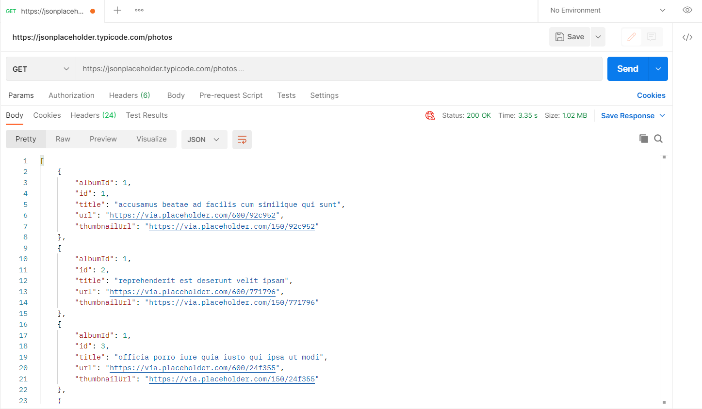
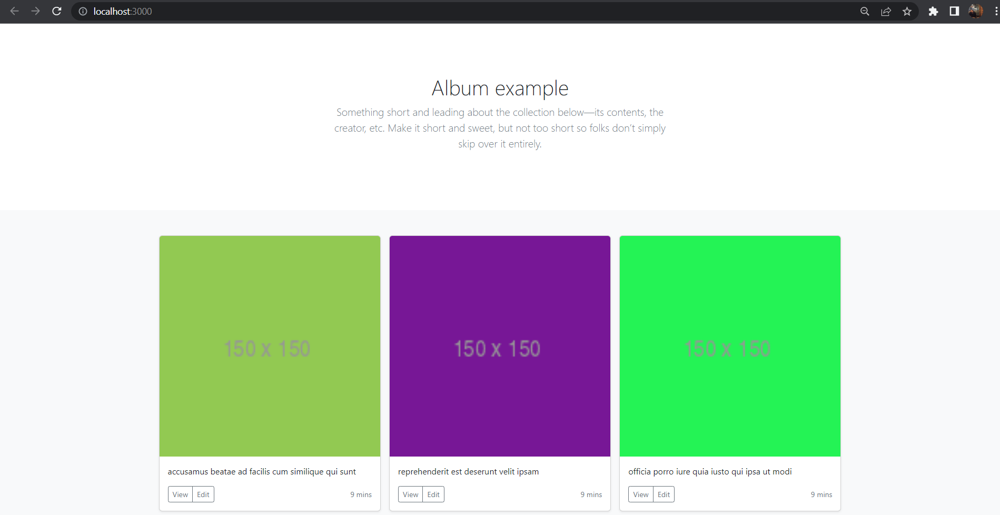

# Ödev Konuları

### **1. Aşağıdaki bağlantıdaki Public API'lerden ilgi çekilen bir tanesi belirlenir.** 

https://github.com/public-apis/public-apis bağlantısından JSONPlaceholder kullanılarak React fetch ile api'den veriler çekilmiştir.

### **2. Postman, Insomnia veya Thunderclient uygulamalarından bu api'ye sorgu atılır ve sorgu sonucu belirlenir.** 

Postman'e atılan sorgu sonucunda aldığımız çıktı aşağıda yer almaktadır.

### **3. Herhangi bir programlama dili ile bu API'ye sorgu atılıp ekrana (veya output olarak) çıktı yazdırılır.**

React ve Bootstrap kullanılarak aşağıdaki çıktı elde edilmiştir.

 

